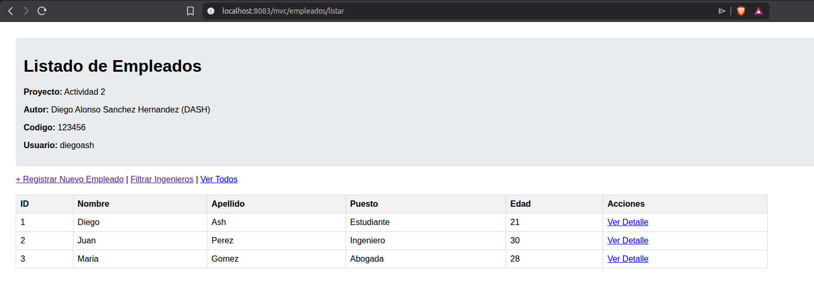
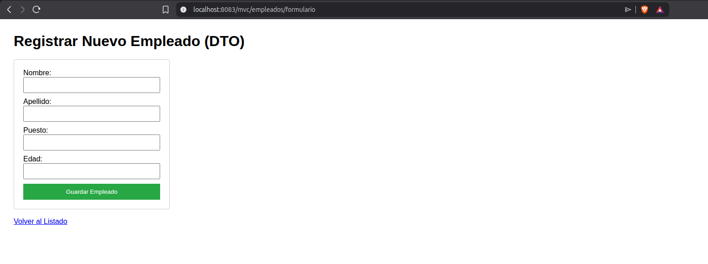
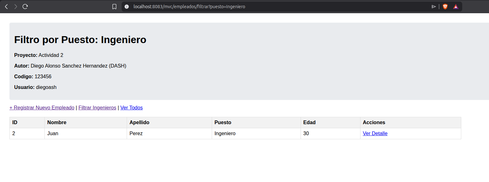
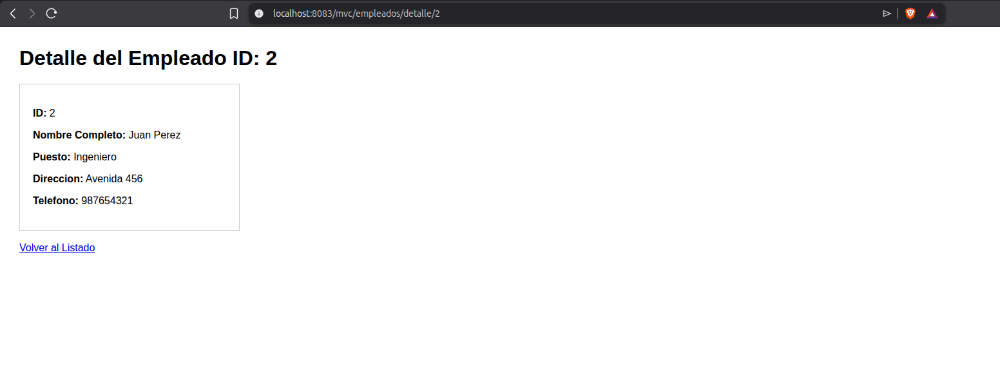
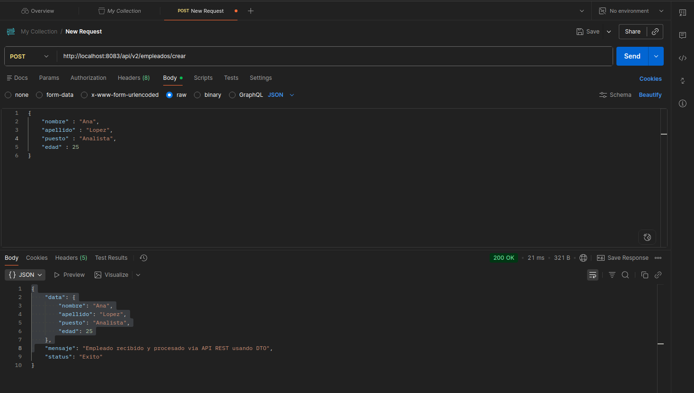

<div align="center">

# Actividad 2 Tema 4. Spring MVC, Thymeleaf, DTOs y Manejo de Peticiones


**Instituto Tecnologico Nacional de Mexico - Instituto Tecnologico de Oaxaca**

| Campo | Valor |
|---|---|
| Carrera | Ingenieria en Sistemas Computacionales |
| Materia | Programacion Web |
| Docente | Adelina Martinez |
| Actividad | Actividad 2. Spring MVC - Vistas con Thymeleaf, DTOs y Manejo de Peticiones |
| Alumno | Diego Alonso Sanchez Hernandez |

</div>

## Enlaces

`http://auramusic.lat:8083/mvc/empleados/listar`
`http://auramusic.lat:8083/mvc/empleados/formulario`
`http://auramusic.lat:8083/mvc/empleados/filtrar?puesto=Ingeniero`
`http://auramusic.lat:8083/mvc/empleados/detalle/2`

Endpoint POST: `http://auramusic.lat:8083/api/v2/empleados/crear`

## Descripcion

Este proyecto incluye:

- vistas renderizadas del lado del servidor
- uso de `Model` para enviar datos a las vistas
- recorrido de listas con `th:each`
- formulario con `@ModelAttribute`
- filtro con `@RequestParam`
- detalle por id con `@PathVariable`
- lectura de propiedades externas con `@Value`
- endpoint REST `POST` con `@RequestBody` usando DTO

## Tecnologias usadas

- Java 17
- Spring Boot 3.2.5
- Spring Web
- Thymeleaf
- Maven Wrapper

## Configuracion

Archivo: `src/main/resources/application.properties`

```properties
spring.application.name=dashact2_t4
server.port=8083

config.autor=Diego Alonso Sanchez Hernandez (DASH)
config.proyecto= Actividad 2
config.codigo= 123456
config.usuario= diegoash
```

## Estructura principal

```text
DASHact2_t4/
├── pom.xml
├── README.md
├── docs/
│   └── capturas/
├── src/
│   ├── main/
│   │   ├── java/com/ash/spring/ejercicio1/dashact2_t4/
│   │   │   ├── Dashact2T4Application.java
│   │   │   ├── controllers/
│   │   │   │   ├── EjemploController.java
│   │   │   │   ├── EjemploRestController.java
│   │   │   │   ├── EmpleadoController.java
│   │   │   │   └── EmpleadoRestController.java
│   │   │   └── models/
│   │   │       ├── Empleados.java
│   │   │       └── dto/
│   │   │           └── EmpleadoDTO.java
│   │   └── resources/
│   │       ├── application.properties
│   │       └── templates/
│   │           ├── detalle_id.html
│   │           ├── detalles_info.html
│   │           ├── formulario_empleado.html
│   │           ├── listado_empleados.html
│   │           └── resultado_formulario.html
│   └── test/
│       └── java/com/ash/spring/ejercicio1/dashact2_t4/
│           └── Dashact2T4ApplicationTests.java
```

## Patron MVC en el proyecto

- Modelo: `Empleados` y `EmpleadoDTO`
- Vista: plantillas Thymeleaf dentro de `src/main/resources/templates`
- Controlador: `EmpleadoController` y `EmpleadoRestController`

## DTO usado

Clase: `src/main/java/com/ash/spring/ejercicio1/dashact2_t4/models/dto/EmpleadoDTO.java`

Campos:

- `nombre`
- `apellido`
- `puesto`
- `edad`

Se usa en:

- el formulario con `@ModelAttribute`
- el endpoint REST `POST` con `@RequestBody`

## Vistas y funcionalidades

### 1. Listado con Thymeleaf y `th:each`

Ruta:

- `GET /mvc/empleados/listar`

Funcion:

- muestra una lista de empleados
- renderiza datos con `Model`
- recorre la lista con `th:each`
- muestra valores leidos desde `application.properties` con `@Value`

### 2. Formulario con `@ModelAttribute`

Rutas:

- `GET /mvc/empleados/formulario`
- `POST /mvc/empleados/guardar`

Funcion:

- muestra un formulario para capturar un nuevo empleado
- recibe los datos con `@ModelAttribute`
- devuelve una vista de resultado

### 3. Filtro con `@RequestParam`

Ruta:

- `GET /mvc/empleados/filtrar?puesto=Ingeniero`

Funcion:

- filtra la lista de empleados por puesto

### 4. Detalle con `@PathVariable`

Ruta:

- `GET /mvc/empleados/detalle/2`

Funcion:

- muestra el detalle de un empleado a partir de su id

### 5. Endpoint REST `POST` con DTO

Ruta:

- `POST /api/v2/empleados/crear`

JSON de prueba:

```json
{
  "nombre": "Ana",
  "apellido": "Lopez",
  "puesto": "Analista",
  "edad": 25
}
```

Respuesta esperada:

```json
{
  "data": {
    "nombre": "Ana",
    "apellido": "Lopez",
    "puesto": "Analista",
    "edad": 25
  },
  "mensaje": "Empleado recibido",
  "status": "Exito"
}
```

## Ejecucion local

```bash
./mvnw spring-boot:run
```

Proyecto local:

- `http://localhost:8083/mvc/empleados/listar`
- `http://localhost:8083/mvc/empleados/formulario`
- `http://localhost:8083/mvc/empleados/filtrar?puesto=Ingeniero`
- `http://localhost:8083/mvc/empleados/detalle/2`
- `http://localhost:8083/api/v2/empleados/crear`

## Evidencias

### Listado con `th:each`



### Formulario con `@ModelAttribute`



### Resultado de `@RequestParam`



### Resultado de `@PathVariable`



### Prueba `POST` en Postman


